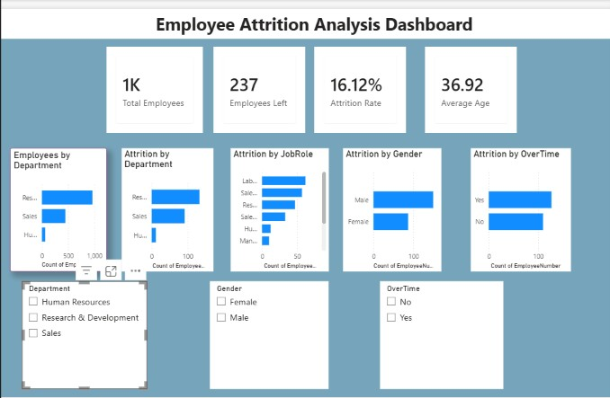

# 📊 Employee Attrition Analysis

A complete HR Analytics project that analyzes employee attrition using Python, SQL, and Power BI.

This project explores the factors affecting employee turnover and provides business insights through data cleaning, exploratory data analysis, SQL queries, and an interactive Power BI dashboard.


## 📌 Project Overview

Employee attrition is one of the biggest challenges faced by organizations. This project analyzes employee data to identify the key factors contributing to employee turnover using data analytics techniques.

The project includes:

- Data Cleaning using Python
- Exploratory Data Analysis (EDA)
- SQL-based Business Analysis
- Interactive Power BI Dashboard
- Business Insights and Recommendations

## 📈 Business Objectives

- Analyze employee attrition trends.
- Identify departments with the highest attrition.
- Understand the relationship between overtime, income, job satisfaction, and employee attrition.
- Build an interactive dashboard for HR decision-making.

## 🛠️ Technologies Used

- Python
- Pandas
- NumPy
- Matplotlib
- SQL (SQLite)
- Power BI
- Jupyter Notebook
- Visual Studio Code

## 📦 Requirements

- Python 3.10 or later
- Jupyter Notebook
- SQLite
- Power BI Desktop

## 📂 Dataset

- Dataset: IBM HR Analytics Employee Attrition
- Total Records: 1470
- Total Features: 35
- Target Variable: Attrition

## 🔄 Project Workflow

1. Data Collection
2. Data Understanding
3. Data Cleaning
4. Exploratory Data Analysis (EDA)
5. SQL Business Analysis
6. Power BI Dashboard Development
7. Business Insights & Recommendations

## 📂 Project Structure

```text
Employee-Attrition-Analysis/
│
├── data/
│   ├── clean/
│   └── raw/
│       └── WA_Fn-UseC_-HR-Employee-Attrition.csv
│
├── images/
│   └── dashboard.png
│
├── notebooks/
│   ├── 01_Data_Understanding.ipynb
│   ├── 02_Data_Cleaning.ipynb
│   └── 03_Exploratory_Data_Analysis.ipynb
│
├── reports/
│   └── Data_Dictionary.xlsx
│
├── sql/
│   ├── Employee_Attrition_SQL_Queries.sql
│   ├── Employee-Attrition-Analysis.db
│   └── Employee-Attrition-Analysis.db-journal
│
├── ARCHITECTURE.md
├── README.md
└── requirements.txt
```
## 📥 Installation

1. Clone the repository

```bash
git clone https://github.com/muskanrajput-1504/Employee-Attrition-Analysis.git
```

2. Navigate to the project folder

```bash
cd Employee-Attrition-Analysis
```

3. Install the required Python libraries

```bash
pip install -r requirements.txt
```
## ▶️ How to Run

1. Open the project in Visual Studio Code or Jupyter Notebook.
2. Open the notebooks in the following order:
   - 01_Data_Understanding.ipynb
   - 02_Data_Cleaning.ipynb
   - 03_Exploratory_Data_Analysis.ipynb
3. Execute the SQL queries available in the `sql` folder using SQLite.
4. Open the Power BI dashboard (`.pbix`) file to explore the interactive visualizations.

## 💡 Key Insights

- Research & Development has the highest number of employees.
- Employees working overtime are more likely to leave the company.
- Sales department shows significant employee attrition.
- Employees with lower job satisfaction tend to leave more frequently.
- Average employee age is approximately 37 years.

## 📊 Dashboard Preview



## 🔮 Future Improvements

- Build a machine learning model to predict employee attrition.
- Deploy the dashboard as a web application.
- Add real-time HR analytics using live datasets.